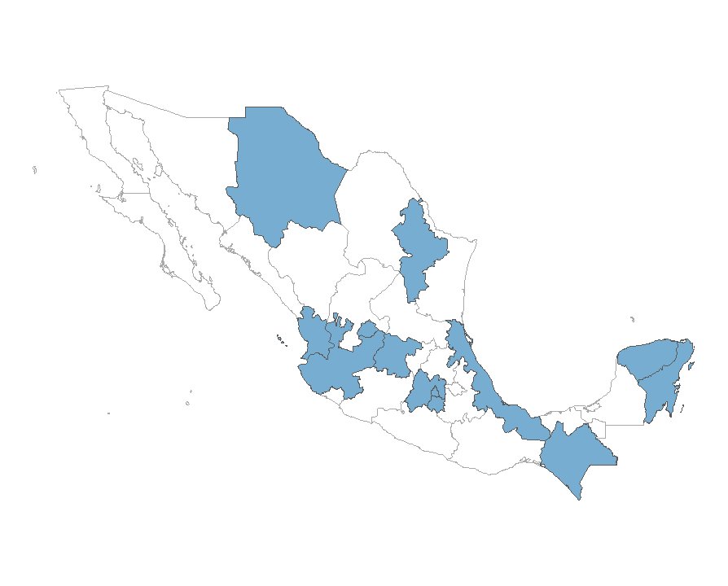
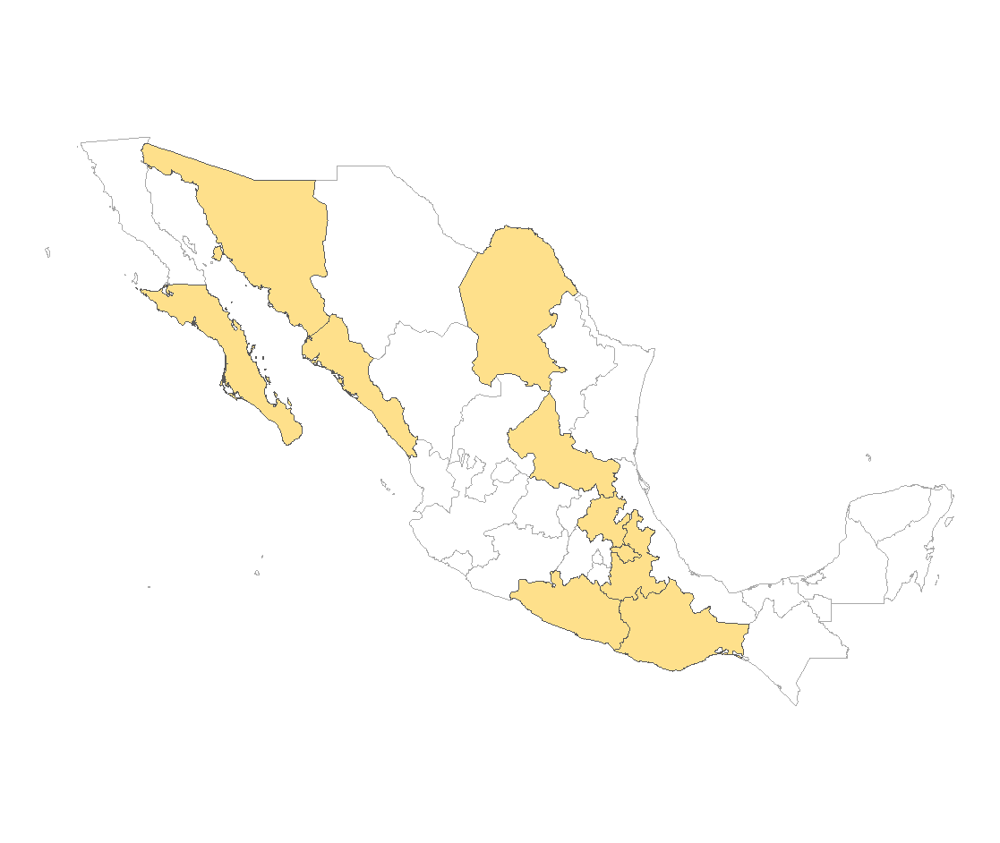
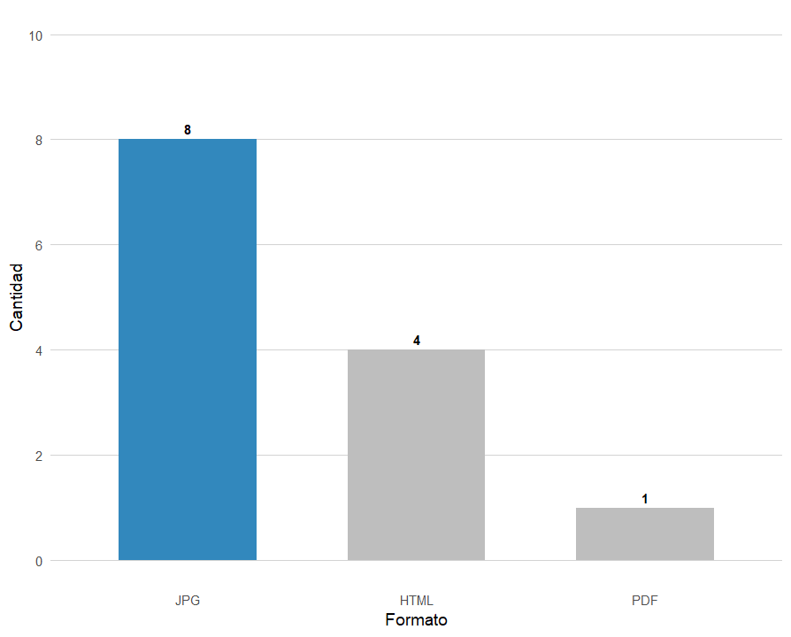

# Informe sobre la Calidad de las Fichas de Alerta AMBER en México
#### Centro de Datos, Algoritmos y Sociedad ITAM

### Introducción
En México, la Alerta AMBER es uno de los mecanismos más importantes para la búsqueda inmediata de niñas, niños y adolescentes desaparecidos. Sin embargo, su efectividad no depende solo de la activación de la alerta, sino también de la calidad y accesibilidad de las fichas que se publican en los portales oficiales. Este informe presenta los hallazgos de una revisión técnica y documental realizada entre enero y mayo de 2025, en la que se evaluó el estado de las plataformas digitales de Alerta AMBER en las 32 entidades federativas y en el portal nacional.

Es importante aclarar que, a pesar de que el equipo realizó una revisión extensa y lo más rigurosa posible, es probable que existan fichas, plataformas o actualizaciones que no hayan sido capturadas. Por este motivo, se ha documentado cada una de las fuentes consultadas y se ha publicado una lista completa de URLs verificadas. Además, el proyecto cuenta con un repositorio público en GitHub donde se puede consultar información complementaria.

### Desigualdad en la publicación y acceso a las fichas
El análisis realizado muestra que México enfrenta serios problemas de heterogeneidad en la forma en que publica y actualiza las fichas de Alerta AMBER. De los 32 estados, solo 13 cuentan con páginas que publican un volumen considerable de fichas y que se actualizan de manera constante. Estas páginas pueden considerarse "funcionales" porque permiten el acceso a información reciente y relevante. En la Figura 1 se presentan estos 13 estados destacados en color azul, lo que permite visualizar que apenas una parte del territorio nacional cuenta con plataformas estables y actualizadas.

> Figura 1. Únicamente 13 estados tienen páginas de Alerta Amber funcionales. Elaboración propia.

Sin embargo, el resto de las entidades presenta múltiples limitaciones. Seis estados mantienen páginas incompletas, ya sea por la escasa cantidad de fichas publicadas, porque las fichas están desactualizadas o porque no permiten filtrar exclusivamente las fichas de Alerta AMBER, mezclándolas con otros mecanismos como el Protocolo Alba o fichas de fiscalías. Un caso ilustrativo es el de Michoacán, cuya página incluye fichas de diferentes mecanismos de búsqueda sin posibilidad de filtrar específicamente las de Alerta AMBER.

Por otra parte, diez entidades dependen exclusivamente de Facebook para la publicación de las fichas. Este es uno de los hallazgos más preocupantes, ya que el uso de esta red social dificulta la trazabilidad y el análisis sistemático de la información. Además, las publicaciones en Facebook no suelen estar organizadas por entidad, ya que frecuentemente se mezclan fichas de distintos estados y de diferentes mecanismos de búsqueda. A esto se suma que las fichas se publican en formato de imagen JPG, lo que limita las posibilidades de extraer y procesar los datos de manera automatizada. La Figura 2 muestra los estados que dependen exclusivamente de Facebook, representados en color amarillo.

> Figura 2. 10 estados tienen acceso a fichas únicamente a través de Facebook. Elaboración propia.

Finalmente, tres estados —Campeche, Durango y Zacatecas— no cuentan con ninguna página oficial ni canal identificado donde se puedan consultar fichas de Alerta AMBER. Esta ausencia representa una grave barrera para la ciudadanía que necesita acceder a esta información en esos estados.

### Limitaciones técnicas en los formatos de publicación
Incluso entre las 13 páginas que podrían considerarse funcionales, se identificaron importantes limitaciones técnicas. De estas páginas, ocho publican fichas exclusivamente en formato JPG. Este tipo de formato es poco adecuado para el análisis automatizado, ya que la información queda contenida en una imagen y no en un formato estructurado que permita su extracción o sistematización. Solo cuatro páginas utilizan HTML, el formato más accesible y estructurado para el análisis de datos. Únicamente una página publica fichas en PDF, lo que también presenta desafíos, ya que no se detecta la estructura de la ficha de una forma tan directa como en HTML. La Figura 3 ilustra esta distribución de formatos, mostrando claramente que la mayoría de las fichas accesibles en las páginas funcionales están en JPG, lo que representa una limitante técnica importante para el análisis de datos.

> Figura 3. De 13 páginas funcionales, 8 no son analizables directamente por estar en formato JPG. Elaboración propia.

Además de los portales estatales, existe un portal nacional que publica fichas en formato PDF para todas las entidades. Sin embargo, este portal no centraliza toda la información disponible en los sitios estatales. Algunas fichas que aparecen en las páginas estatales no están disponibles en el portal nacional, lo que plantea preguntas sobre los criterios utilizados para seleccionar qué fichas se publican a nivel nacional. Hasta el momento, estos criterios no son públicos ni transparentes.

### Resultados por entidad federativa
La siguiente tabla resume los hallazgos por entidad federativa, destacando la existencia o no de página oficial, las características de la publicación y el formato en que se presentan las fichas:

| Estado               | Página Amber      | Características             | Formato     | Observaciones  adicionales                                                                     |
|----------------------|-------------------|-----------------------------|-------------|-----------------------------------------------------------------------------------------------|
| Aguascalientes       | Sí                | Funcional                   | PDF         |                                                                                               |
| Baja California      | Sí                | Solo contiene una ficha     | JPG         |                                                                                               |
| Baja California Sur  | Facebook          | -                           | JPG         |                                                                                               |
| Campeche             | No                | -                           | -           |                                                                                               |
| Chiapas              | Sí                | Funcional                   | HTML        |                                                                                               |
| Chihuahua            | Sí                | Funcional                   | JPG         |                                                                                               |
| Ciudad de México     | Sí                | Funcional                   | JPG         |                                                                                               |
| Coahuila             | Facebook          | -                           | JPG         |                                                                                               |
| Colima               | Sí                | Solo fichas inactivas       | HTML        |                                                                                               |
| Durango              | No                | -                           | -           |                                                                                               |
| Estado de México     | Sí                | Funcional                   | JPG         |                                                                                               |
| Guanajuato           | Sí                | Funcional                   | HTML        |                                                                                               |
| Guerrero             | Facebook          | -                           | JPG         |                                                                                               |
| Hidalgo              | Facebook          | -                           | JPG         |                                                                                               |
| Jalisco              | Sí                | Funcional                   | JPG         |                                                                                               |
| Michoacán            | No (Fiscalia)     | No es exclusiva de amber    | PDF         | La página contiene fichas de Alerta Ámber, Protocolo Alba y de la fiscalía, pero no se puede filtrar en exclusivamente Ámber |
| Morelos              | Sí                | Funcional                   | JPG         |                                                                                               |
| Nayarit              | Sí                | Funcional                   | HTML        |                                                                                               |
| Nuevo León           | Sí                | Funcional                   | HTML        |                                                                                               |
| Oaxaca               | Facebook          | -                           | JPG         |                                                                                               |
| Puebla               | Facebook          | -                           | JPG         |                                                                                               |
| Querétaro            | Sí                | Fichas sin nombre hasta 2024| HTML        | Solo tiene el número de la alerta, su estatus, la activación y la desactivación. No contiene campos clave como nombre ni fotografía |
| Quintana Roo         | Sí                | Funcional                   | JPG         |                                                                                               |
| San Luis Potosí      | Facebook          | -                           | JPG         |                                                                                               |
| Sinaloa              | Facebook          | -                           | JPG         |                                                                                               |
| Sonora               | Facebook          | -                           | JPG         |                                                                                               |
| Tabasco              | Sí                | Fichas duplicadas           | PDF         | Fichas duplicadas por nombre. No distingue entre mayúsculas y minúsculas                     |
| Tamaulipas           | Sí                | Solo contiene una ficha     | JPG         |                                                                                               |
| Tlaxcala             | Facebook          | -                           | JPG         |                                                                                               |
| Veracruz             | Sí                | Funcional                   | JPG         |                                                                                               |
| Yucatán              | Sí                | Funcional                   | JPG         |                                                                                               |
| Zacatecas            | No                | -                           | -           |                                                                                               |
| Nacional             | Sí                | Funcional                   | PDF         | No es un portal centralizado con todas las fichas                                                                                                  |
  

### Conclusión
El análisis evidencia que México enfrenta limitaciones significativas en la gestión, publicación y accesibilidad de las fichas de Alerta AMBER. La desigualdad en la actualización de las páginas estatales, la diversidad de formatos poco adecuados para el análisis automatizado y la ausencia de un sistema centralizado y transparente afectan la capacidad de la sociedad civil y las autoridades para acceder y utilizar esta información de manera eficiente.

Es urgente que las autoridades estandaricen los formatos y campos de las fichas a nivel nacional, mejoren la accesibilidad técnica evitando el uso de formatos no analizables como imágenes JPG, y fortalezcan la actualización y mantenimiento de las páginas estatales. Asimismo, resulta fundamental que el portal nacional funcione como una verdadera base de datos centralizada, con criterios públicos y transparentes para la publicación de fichas. Solo mediante estas acciones se podrá garantizar que la información esté disponible y sea útil para apoyar los esfuerzos de búsqueda, análisis y colaboración entre la sociedad civil, las autoridades y las familias afectadas.

## Anexo: Lista completa de URLs encontrados por estado

### Páginas Funcionales de Alerta AMBER

Estas páginas están activas, actualizadas y presentan fichas con información accesible:
- Aguascalientes: [https://www.fiscalia-aguascalientes.gob.mx/Alerta_Amber.aspx](https://www.fiscalia-aguascalientes.gob.mx/Alerta_Amber.aspx)
- Chiapas: [(https://www.amberchiapas.org.mx/](https://www.amberchiapas.org.mx/)
- Chihuahua: [https://fiscalia.chihuahua.gob.mx/alerta-amber/](https://fiscalia.chihuahua.gob.mx/alerta-amber/)
- Ciudad de México: [https://www.fgjcdmx.gob.mx/nuestros-servicios/servicios-la-ciudadania/alerta-amber-df](https://www.fgjcdmx.gob.mx/nuestros-servicios/servicios-la-ciudadania/alerta-amber-df)
- Estado de México: [https://cobupem.edomex.gob.mx/alerta-amber](https://cobupem.edomex.gob.mx/alerta-amber)
- Guanajuato: [https://portal.fgeguanajuato.gob.mx/PortalWebEstatal/AlertaAmber/Formularios/frmAAEstado.aspx](https://portal.fgeguanajuato.gob.mx/PortalWebEstatal/AlertaAmber/Formularios/frmAAEstado.aspx)
- Jalisco: [https://fiscaliaenpersonasdesaparecidas.jalisco.gob.mx/?f1=&f2=&f3=&f4=&wpcfs=preset-1](https://fiscaliaenpersonasdesaparecidas.jalisco.gob.mx/?f1=&f2=&f3=&f4=&wpcfs=preset-1)
- Morelos: [https://fiscaliamorelos.gob.mx/alerta-amber-morelos/](https://fiscaliamorelos.gob.mx/alerta-amber-morelos/)
- Nayarit: [https://fiscaliageneral.nayarit.gob.mx/web/container.php?page=amber&ttl=23](https://fiscaliageneral.nayarit.gob.mx/web/container.php?page=amber&ttl=23)
- Nuevo León: [https://fiscalianl.gob.mx/AlertaAmber](https://fiscalianl.gob.mx/AlertaAmber)
- Quintana Roo: [https://www.fgeqroo.gob.mx/alertas/Amber](https://www.fgeqroo.gob.mx/alertas/Amber)
- Veracruz: [https://fiscaliaveracruz.gob.mx/category/alerta-amber-activadas/](https://fiscaliaveracruz.gob.mx/category/alerta-amber-activadas/)
- Yucatán: [https://fge.yucatan.gob.mx/micrositios/alerta-amber](https://fge.yucatan.gob.mx/micrositios/alerta-amber)
- Nacional: [https://alertaamber.fgr.org.mx/](https://alertaamber.fgr.org.mx/)
  
### Páginas Incompletas o con Limitaciones

- Baja California: [https://fgebc.gob.mx/component/tags/tag/alerta-amber](https://fgebc.gob.mx/component/tags/tag/alerta-amber) — Solo una ficha de 2020
- Colima:
  - [http://www.fgecolima.mx/fge_amber_colima.php](http://www.fgecolima.mx/fge_amber_colima.php) — Solo fichas inactivas
  - [http://www.pgj.col.gob.mx/FGEColima/fge_amber_colima.php](http://www.pgj.col.gob.mx/FGEColima/fge_amber_colima.php) — Solo el formato de las fichas
- Michoacán: [https://michoacan.gob.mx/busqueda/filtros.php](https://michoacan.gob.mx/busqueda/filtros.php) — No hay separación específica de Alerta Ámber
- Querétaro: [https://fiscaliageneralqro.gob.mx/alertaamber/alertas/](https://fiscaliageneralqro.gob.mx/alertaamber/alertas/) — Sin nombres, imágenes ni información detallada
- Tabasco: [https://www.fiscaliatabasco.gob.mx/AtencionVictimas/AlertaAmber](https://www.fiscaliatabasco.gob.mx/AtencionVictimas/AlertaAmber) — Hay duplicados por nombre
- Tamaulipas: [https://www.fgjtam.gob.mx/boletin_busqueda/alerta-amber-6/](https://www.fgjtam.gob.mx/boletin_busqueda/alerta-amber-6/) — Solo una ficha
